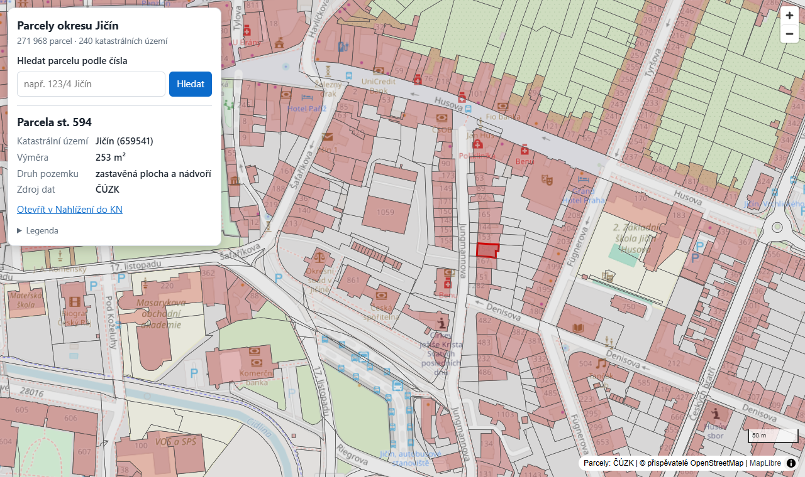

# Parcely Jičín

[](https://github.com/Martin03100/parcely-jicin/actions/workflows/ci.yml)

Interactive map of cadastral parcels in the Jičín district (Czech Republic): 271,968 parcels in 240 cadastral areas from the ČÚZK INSPIRE service.

**Live demo:** https://parcely-jicin-4sjf.onrender.com (free tier, the first load may take up to a minute)



- Smooth rendering of the whole district using vector tiles generated by PostGIS
- Parcel detail on click: number, cadastral area, area, land type, link to the official cadastre viewer
- Search by parcel number, optionally with the building plot prefix or the cadastral area name (`123/4`, `st. 56`, `123/4 Jičín`)

**Stack:** PHP 8.3 with no framework or dependencies, PostgreSQL 16 + PostGIS 3.4, MapLibre GL JS, Docker.

## Running locally

```bash
docker compose up -d --build --wait
bin/import-cuzk.sh        # real data for the district (~20 min)
# or
bin/seed-demo.sh          # synthetic data (seconds)
```

Open http://localhost:8080 (add `?debug` to show FPS).

Tests: `docker compose exec app php tests/run.php`

## Architecture

```
browser (MapLibre) ── /tiles/{z}/{x}/{y}.pbf ──► TileController ──► file cache ──► PostGIS ST_AsMVT
                   ── /api/parcels/{id}      ──► ParcelController ──► ParcelRepository
                   ── /api/search?q=123/4
                   ── /api/meta
```

| Path | Contents |
|---|---|
| `public/` | Front controller, frontend (`index.html`, `assets/`) |
| `src/` | Router, controllers, repositories, tile cache |
| `db/` | Schema, import transforms, outlines |
| `bin/` | Import, export, demo seed, benchmark |
| `tests/` | Unit tests (no dependencies) |
| `docker/` | Apache config, container entrypoint |

### Design decisions

- **Imported data, not live WFS.** The data is imported once into PostGIS, so the app does not depend on the speed or availability of the ČÚZK service.
- **Vector tiles.** The browser only loads what is in view, so performance does not depend on the total parcel count.
- **Tiles built in PostGIS.** `ST_AsMVT` clips, quantizes and encodes the tiles using the GiST index. Geometry is stored in EPSG:3857, so nothing is reprojected at runtime. Rows are stored in spatial order, so one tile reads few disk pages.
- **Two levels of detail.** Below zoom 14 the map shows cadastral area outlines, and individual parcels from zoom 14.
- **Caching.** Tiles are cached gzipped on disk and served with `ETag` and `Cache-Control`. The cache is cleared on import. Empty tiles return `204` and are not stored on disk.
- **No framework.** Four endpoints only need a small router and a PSR-4 autoloader.

## Data

Source: [ČÚZK INSPIRE Cadastral Parcels](https://services.cuzk.cz/wfs/inspire-cp-wfs.asp) (WFS 2.0) © ČÚZK, CC BY 4.0. The district boundary comes from INSPIRE Administrative Units.

`bin/import-cuzk.sh` downloads the district in 0.02° cells and checks that `numberMatched == numberReturned` for every cell. It then loads the cells with `ogr2ogr`, clips them to the district boundary and transforms them in `db/transform_cuzk.sql`. Set `BBOX="minlon minlat maxlon maxlat"` to import a smaller area.

INSPIRE data does not include land type or land use. Building plots (`st.`) are shown as built-up areas, and all other parcels are grey.

## Performance

`docker compose exec app php bin/bench.php http://localhost`, 271,968 parcels, 40 random tiles per zoom level, cold = generated by PostGIS, warm = from cache:

| Zoom | Cold p50 | Cold p95 | Warm p50 | Size (gzip) |
|---|---:|---:|---:|---:|
| 10 (outlines) | 51 ms | 192 ms | 1.2 ms | 1.9 kB |
| 13 (outlines) | 44 ms | 71 ms | 1.0 ms | 2.6 kB |
| 14 (parcels) | 105 ms | 149 ms | 1.3 ms | 28 kB |
| 16 | 48 ms | 69 ms | 0.9 ms | 2.0 kB |

## Deployment

[](https://render.com/deploy?repo=https://github.com/Martin03100/parcely-jicin)

`render.yaml` defines the web service and the database. The import requires GDAL, so it runs locally. `bin/export-data.sh` writes the parcels to a compressed TSV, which is attached to a GitHub release. On startup, `docker/entrypoint.sh` loads the file from `DATA_URL` if it has not been loaded yet.

## Security

- All SQL uses prepared statements, and inputs are validated by strict regular expressions.
- Tile coordinates are limited to zoom 16. Only non-empty tiles are cached, so arbitrary requests cannot fill the disk.
- The frontend writes only `textContent`, never HTML.
- Responses send `Content-Security-Policy`, `X-Content-Type-Options` and `Referrer-Policy` headers. Third-party scripts are pinned with Subresource Integrity.
- PHP errors are logged, not displayed, and server versions are hidden.

## API

| Endpoint | Description |
|---|---|
| `GET /tiles/{z}/{x}/{y}.pbf` | Vector tile (`ku` layer below zoom 14, `parcels` layer from zoom 14) |
| `GET /api/parcels/{id}` | Parcel detail |
| `GET /api/search?q=123/4[&ku=659541]` | Search (`123`, `123/4`, `st. 56`, `123/4 Jičín`), max. 20 results |
| `GET /api/meta` | Parcel count and data extent |
